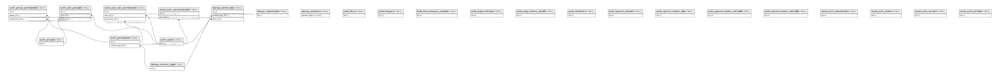

# hogehoge_dev

## Tables

| Name | Columns | Comment | Type |
| ---- | ------- | ------- | ---- |
| [auth_group](auth_group.md) | 2 |  | BASE TABLE |
| [auth_group_permissions](auth_group_permissions.md) | 3 |  | BASE TABLE |
| [auth_permission](auth_permission.md) | 4 |  | BASE TABLE |
| [auth_user](auth_user.md) | 11 |  | BASE TABLE |
| [auth_user_groups](auth_user_groups.md) | 3 |  | BASE TABLE |
| [auth_user_user_permissions](auth_user_user_permissions.md) | 3 |  | BASE TABLE |
| [django_admin_log](django_admin_log.md) | 8 |  | BASE TABLE |
| [django_content_type](django_content_type.md) | 3 |  | BASE TABLE |
| [django_migrations](django_migrations.md) | 4 |  | BASE TABLE |
| [django_session](django_session.md) | 3 |  | BASE TABLE |
| [polls_file](polls_file.md) | 3 |  | BASE TABLE |
| [polls_image](polls_image.md) | 3 |  | BASE TABLE |
| [polls_item_category_master](polls_item_category_master.md) | 10 |  | BASE TABLE |
| [polls_judge_history](polls_judge_history.md) | 8 |  | BASE TABLE |
| [polls_judge_history_detail](polls_judge_history_detail.md) | 14 |  | BASE TABLE |
| [polls_member](polls_member.md) | 3 |  | BASE TABLE |
| [polls_ngword_master](polls_ngword_master.md) | 11 |  | BASE TABLE |
| [polls_ngword_master_old](polls_ngword_master_old.md) | 10 |  | BASE TABLE |
| [polls_ngword_master_old1109](polls_ngword_master_old1109.md) | 10 |  | BASE TABLE |
| [polls_ngword_master_old1130](polls_ngword_master_old1130.md) | 10 |  | BASE TABLE |
| [social_auth_association](social_auth_association.md) | 7 |  | BASE TABLE |
| [social_auth_code](social_auth_code.md) | 5 |  | BASE TABLE |
| [social_auth_nonce](social_auth_nonce.md) | 4 |  | BASE TABLE |
| [social_auth_partial](social_auth_partial.md) | 6 |  | BASE TABLE |
| [social_auth_usersocialauth](social_auth_usersocialauth.md) | 5 |  | BASE TABLE |

## Relations

---

> Generated by [tbls](https://github.com/k1LoW/tbls)
