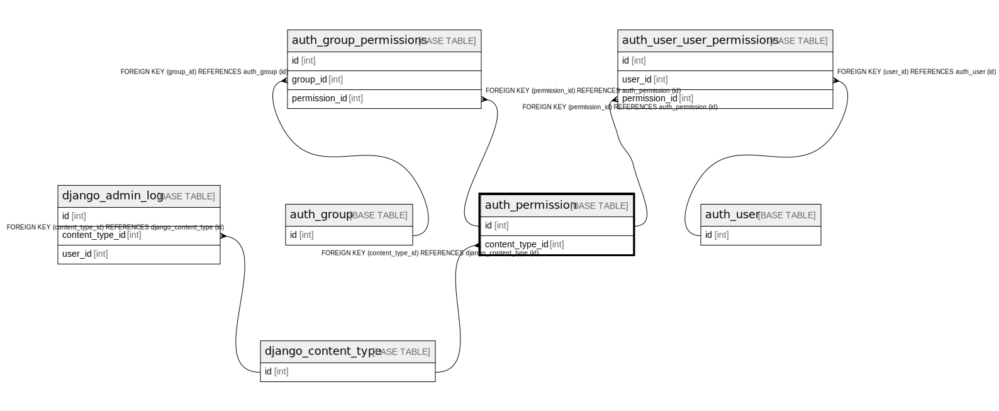

# auth_permission

## Description

<details>
<summary><strong>Table Definition</strong></summary>

```sql
CREATE TABLE `auth_permission` (
  `id` int NOT NULL AUTO_INCREMENT,
  `name` varchar(255) NOT NULL,
  `content_type_id` int NOT NULL,
  `codename` varchar(100) NOT NULL,
  PRIMARY KEY (`id`),
  UNIQUE KEY `auth_permission_content_type_id_codename_01ab375a_uniq` (`content_type_id`,`codename`),
  CONSTRAINT `auth_permission_content_type_id_2f476e4b_fk_django_co` FOREIGN KEY (`content_type_id`) REFERENCES `django_content_type` (`id`)
) ENGINE=InnoDB AUTO_INCREMENT=[Redacted by tbls] DEFAULT CHARSET=utf8mb4 COLLATE=utf8mb4_0900_ai_ci
```

</details>

## Columns

| Name | Type | Default | Nullable | Extra Definition | Children | Parents | Comment |
| ---- | ---- | ------- | -------- | ---------------- | -------- | ------- | ------- |
| id | int |  | false | auto_increment | [auth_group_permissions](auth_group_permissions.md) [auth_user_user_permissions](auth_user_user_permissions.md) |  |  |
| name | varchar(255) |  | false |  |  |  |  |
| content_type_id | int |  | false |  |  | [django_content_type](django_content_type.md) |  |
| codename | varchar(100) |  | false |  |  |  |  |

## Constraints

| Name | Type | Definition |
| ---- | ---- | ---------- |
| auth_permission_content_type_id_2f476e4b_fk_django_co | FOREIGN KEY | FOREIGN KEY (content_type_id) REFERENCES django_content_type (id) |
| auth_permission_content_type_id_codename_01ab375a_uniq | UNIQUE | UNIQUE KEY auth_permission_content_type_id_codename_01ab375a_uniq (content_type_id, codename) |
| PRIMARY | PRIMARY KEY | PRIMARY KEY (id) |

## Indexes

| Name | Definition |
| ---- | ---------- |
| PRIMARY | PRIMARY KEY (id) USING BTREE |
| auth_permission_content_type_id_codename_01ab375a_uniq | UNIQUE KEY auth_permission_content_type_id_codename_01ab375a_uniq (content_type_id, codename) USING BTREE |

## Relations



---

> Generated by [tbls](https://github.com/k1LoW/tbls)
