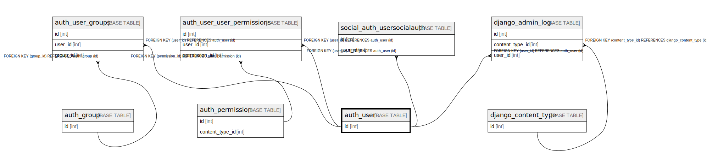

# auth_user

## Description

<details>
<summary><strong>Table Definition</strong></summary>

```sql
CREATE TABLE `auth_user` (
  `id` int NOT NULL AUTO_INCREMENT,
  `password` varchar(128) NOT NULL,
  `last_login` datetime(6) DEFAULT NULL,
  `is_superuser` tinyint(1) NOT NULL,
  `username` varchar(150) NOT NULL,
  `first_name` varchar(30) NOT NULL,
  `last_name` varchar(150) NOT NULL,
  `email` varchar(254) NOT NULL,
  `is_staff` tinyint(1) NOT NULL,
  `is_active` tinyint(1) NOT NULL,
  `date_joined` datetime(6) NOT NULL,
  PRIMARY KEY (`id`),
  UNIQUE KEY `username` (`username`)
) ENGINE=InnoDB AUTO_INCREMENT=[Redacted by tbls] DEFAULT CHARSET=utf8mb4 COLLATE=utf8mb4_0900_ai_ci
```

</details>

## Columns

| Name | Type | Default | Nullable | Extra Definition | Children | Parents | Comment |
| ---- | ---- | ------- | -------- | ---------------- | -------- | ------- | ------- |
| id | int |  | false | auto_increment | [auth_user_groups](auth_user_groups.md) [auth_user_user_permissions](auth_user_user_permissions.md) [django_admin_log](django_admin_log.md) [social_auth_usersocialauth](social_auth_usersocialauth.md) |  |  |
| password | varchar(128) |  | false |  |  |  |  |
| last_login | datetime(6) |  | true |  |  |  |  |
| is_superuser | tinyint(1) |  | false |  |  |  |  |
| username | varchar(150) |  | false |  |  |  |  |
| first_name | varchar(30) |  | false |  |  |  |  |
| last_name | varchar(150) |  | false |  |  |  |  |
| email | varchar(254) |  | false |  |  |  |  |
| is_staff | tinyint(1) |  | false |  |  |  |  |
| is_active | tinyint(1) |  | false |  |  |  |  |
| date_joined | datetime(6) |  | false |  |  |  |  |

## Constraints

| Name | Type | Definition |
| ---- | ---- | ---------- |
| PRIMARY | PRIMARY KEY | PRIMARY KEY (id) |
| username | UNIQUE | UNIQUE KEY username (username) |

## Indexes

| Name | Definition |
| ---- | ---------- |
| PRIMARY | PRIMARY KEY (id) USING BTREE |
| username | UNIQUE KEY username (username) USING BTREE |

## Relations



---

> Generated by [tbls](https://github.com/k1LoW/tbls)
