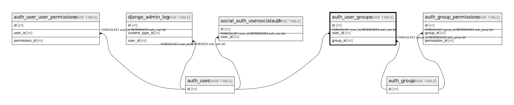

# auth_user_groups

## Description

<details>
<summary><strong>Table Definition</strong></summary>

```sql
CREATE TABLE `auth_user_groups` (
  `id` int NOT NULL AUTO_INCREMENT,
  `user_id` int NOT NULL,
  `group_id` int NOT NULL,
  PRIMARY KEY (`id`),
  UNIQUE KEY `auth_user_groups_user_id_group_id_94350c0c_uniq` (`user_id`,`group_id`),
  KEY `auth_user_groups_group_id_97559544_fk_auth_group_id` (`group_id`),
  CONSTRAINT `auth_user_groups_group_id_97559544_fk_auth_group_id` FOREIGN KEY (`group_id`) REFERENCES `auth_group` (`id`),
  CONSTRAINT `auth_user_groups_user_id_6a12ed8b_fk_auth_user_id` FOREIGN KEY (`user_id`) REFERENCES `auth_user` (`id`)
) ENGINE=InnoDB DEFAULT CHARSET=utf8mb4 COLLATE=utf8mb4_0900_ai_ci
```

</details>

## Columns

| Name | Type | Default | Nullable | Extra Definition | Children | Parents | Comment |
| ---- | ---- | ------- | -------- | ---------------- | -------- | ------- | ------- |
| id | int |  | false | auto_increment |  |  |  |
| user_id | int |  | false |  |  | [auth_user](auth_user.md) |  |
| group_id | int |  | false |  |  | [auth_group](auth_group.md) |  |

## Constraints

| Name | Type | Definition |
| ---- | ---- | ---------- |
| auth_user_groups_group_id_97559544_fk_auth_group_id | FOREIGN KEY | FOREIGN KEY (group_id) REFERENCES auth_group (id) |
| auth_user_groups_user_id_6a12ed8b_fk_auth_user_id | FOREIGN KEY | FOREIGN KEY (user_id) REFERENCES auth_user (id) |
| auth_user_groups_user_id_group_id_94350c0c_uniq | UNIQUE | UNIQUE KEY auth_user_groups_user_id_group_id_94350c0c_uniq (user_id, group_id) |
| PRIMARY | PRIMARY KEY | PRIMARY KEY (id) |

## Indexes

| Name | Definition |
| ---- | ---------- |
| auth_user_groups_group_id_97559544_fk_auth_group_id | KEY auth_user_groups_group_id_97559544_fk_auth_group_id (group_id) USING BTREE |
| PRIMARY | PRIMARY KEY (id) USING BTREE |
| auth_user_groups_user_id_group_id_94350c0c_uniq | UNIQUE KEY auth_user_groups_user_id_group_id_94350c0c_uniq (user_id, group_id) USING BTREE |

## Relations



---

> Generated by [tbls](https://github.com/k1LoW/tbls)
