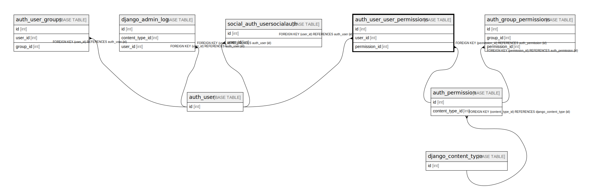

# auth_user_user_permissions

## Description

<details>
<summary><strong>Table Definition</strong></summary>

```sql
CREATE TABLE `auth_user_user_permissions` (
  `id` int NOT NULL AUTO_INCREMENT,
  `user_id` int NOT NULL,
  `permission_id` int NOT NULL,
  PRIMARY KEY (`id`),
  UNIQUE KEY `auth_user_user_permissions_user_id_permission_id_14a6b632_uniq` (`user_id`,`permission_id`),
  KEY `auth_user_user_permi_permission_id_1fbb5f2c_fk_auth_perm` (`permission_id`),
  CONSTRAINT `auth_user_user_permi_permission_id_1fbb5f2c_fk_auth_perm` FOREIGN KEY (`permission_id`) REFERENCES `auth_permission` (`id`),
  CONSTRAINT `auth_user_user_permissions_user_id_a95ead1b_fk_auth_user_id` FOREIGN KEY (`user_id`) REFERENCES `auth_user` (`id`)
) ENGINE=InnoDB DEFAULT CHARSET=utf8mb4 COLLATE=utf8mb4_0900_ai_ci
```

</details>

## Columns

| Name | Type | Default | Nullable | Extra Definition | Children | Parents | Comment |
| ---- | ---- | ------- | -------- | ---------------- | -------- | ------- | ------- |
| id | int |  | false | auto_increment |  |  |  |
| user_id | int |  | false |  |  | [auth_user](auth_user.md) |  |
| permission_id | int |  | false |  |  | [auth_permission](auth_permission.md) |  |

## Constraints

| Name | Type | Definition |
| ---- | ---- | ---------- |
| auth_user_user_permi_permission_id_1fbb5f2c_fk_auth_perm | FOREIGN KEY | FOREIGN KEY (permission_id) REFERENCES auth_permission (id) |
| auth_user_user_permissions_user_id_a95ead1b_fk_auth_user_id | FOREIGN KEY | FOREIGN KEY (user_id) REFERENCES auth_user (id) |
| auth_user_user_permissions_user_id_permission_id_14a6b632_uniq | UNIQUE | UNIQUE KEY auth_user_user_permissions_user_id_permission_id_14a6b632_uniq (user_id, permission_id) |
| PRIMARY | PRIMARY KEY | PRIMARY KEY (id) |

## Indexes

| Name | Definition |
| ---- | ---------- |
| auth_user_user_permi_permission_id_1fbb5f2c_fk_auth_perm | KEY auth_user_user_permi_permission_id_1fbb5f2c_fk_auth_perm (permission_id) USING BTREE |
| PRIMARY | PRIMARY KEY (id) USING BTREE |
| auth_user_user_permissions_user_id_permission_id_14a6b632_uniq | UNIQUE KEY auth_user_user_permissions_user_id_permission_id_14a6b632_uniq (user_id, permission_id) USING BTREE |

## Relations



---

> Generated by [tbls](https://github.com/k1LoW/tbls)
