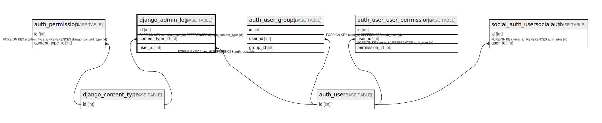

# django_admin_log

## Description

<details>
<summary><strong>Table Definition</strong></summary>

```sql
CREATE TABLE `django_admin_log` (
  `id` int NOT NULL AUTO_INCREMENT,
  `action_time` datetime(6) NOT NULL,
  `object_id` longtext,
  `object_repr` varchar(200) NOT NULL,
  `action_flag` smallint unsigned NOT NULL,
  `change_message` longtext NOT NULL,
  `content_type_id` int DEFAULT NULL,
  `user_id` int NOT NULL,
  PRIMARY KEY (`id`),
  KEY `django_admin_log_content_type_id_c4bce8eb_fk_django_co` (`content_type_id`),
  KEY `django_admin_log_user_id_c564eba6_fk_auth_user_id` (`user_id`),
  CONSTRAINT `django_admin_log_content_type_id_c4bce8eb_fk_django_co` FOREIGN KEY (`content_type_id`) REFERENCES `django_content_type` (`id`),
  CONSTRAINT `django_admin_log_user_id_c564eba6_fk_auth_user_id` FOREIGN KEY (`user_id`) REFERENCES `auth_user` (`id`)
) ENGINE=InnoDB DEFAULT CHARSET=utf8mb4 COLLATE=utf8mb4_0900_ai_ci
```

</details>

## Columns

| Name | Type | Default | Nullable | Extra Definition | Children | Parents | Comment |
| ---- | ---- | ------- | -------- | ---------------- | -------- | ------- | ------- |
| id | int |  | false | auto_increment |  |  |  |
| action_time | datetime(6) |  | false |  |  |  |  |
| object_id | longtext |  | true |  |  |  |  |
| object_repr | varchar(200) |  | false |  |  |  |  |
| action_flag | smallint unsigned |  | false |  |  |  |  |
| change_message | longtext |  | false |  |  |  |  |
| content_type_id | int |  | true |  |  | [django_content_type](django_content_type.md) |  |
| user_id | int |  | false |  |  | [auth_user](auth_user.md) |  |

## Constraints

| Name | Type | Definition |
| ---- | ---- | ---------- |
| django_admin_log_content_type_id_c4bce8eb_fk_django_co | FOREIGN KEY | FOREIGN KEY (content_type_id) REFERENCES django_content_type (id) |
| django_admin_log_user_id_c564eba6_fk_auth_user_id | FOREIGN KEY | FOREIGN KEY (user_id) REFERENCES auth_user (id) |
| PRIMARY | PRIMARY KEY | PRIMARY KEY (id) |

## Indexes

| Name | Definition |
| ---- | ---------- |
| django_admin_log_content_type_id_c4bce8eb_fk_django_co | KEY django_admin_log_content_type_id_c4bce8eb_fk_django_co (content_type_id) USING BTREE |
| django_admin_log_user_id_c564eba6_fk_auth_user_id | KEY django_admin_log_user_id_c564eba6_fk_auth_user_id (user_id) USING BTREE |
| PRIMARY | PRIMARY KEY (id) USING BTREE |

## Relations



---

> Generated by [tbls](https://github.com/k1LoW/tbls)
