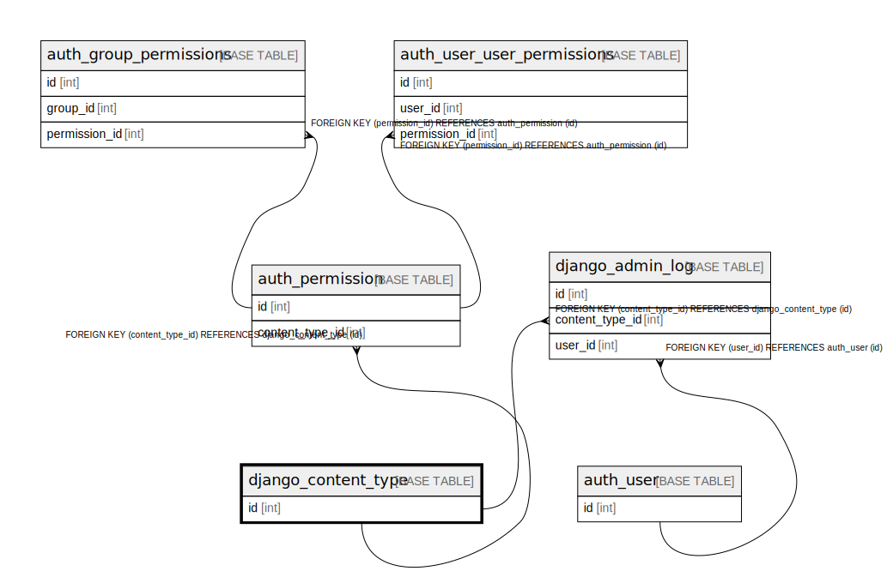

# django_content_type

## Description

<details>
<summary><strong>Table Definition</strong></summary>

```sql
CREATE TABLE `django_content_type` (
  `id` int NOT NULL AUTO_INCREMENT,
  `app_label` varchar(100) NOT NULL,
  `model` varchar(100) NOT NULL,
  PRIMARY KEY (`id`),
  UNIQUE KEY `django_content_type_app_label_model_76bd3d3b_uniq` (`app_label`,`model`)
) ENGINE=InnoDB AUTO_INCREMENT=[Redacted by tbls] DEFAULT CHARSET=utf8mb4 COLLATE=utf8mb4_0900_ai_ci
```

</details>

## Columns

| Name | Type | Default | Nullable | Extra Definition | Children | Parents | Comment |
| ---- | ---- | ------- | -------- | ---------------- | -------- | ------- | ------- |
| id | int |  | false | auto_increment | [auth_permission](auth_permission.md) [django_admin_log](django_admin_log.md) |  |  |
| app_label | varchar(100) |  | false |  |  |  |  |
| model | varchar(100) |  | false |  |  |  |  |

## Constraints

| Name | Type | Definition |
| ---- | ---- | ---------- |
| django_content_type_app_label_model_76bd3d3b_uniq | UNIQUE | UNIQUE KEY django_content_type_app_label_model_76bd3d3b_uniq (app_label, model) |
| PRIMARY | PRIMARY KEY | PRIMARY KEY (id) |

## Indexes

| Name | Definition |
| ---- | ---------- |
| PRIMARY | PRIMARY KEY (id) USING BTREE |
| django_content_type_app_label_model_76bd3d3b_uniq | UNIQUE KEY django_content_type_app_label_model_76bd3d3b_uniq (app_label, model) USING BTREE |

## Relations



---

> Generated by [tbls](https://github.com/k1LoW/tbls)
