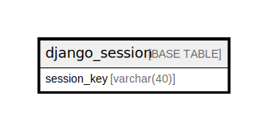

# django_session

## Description

<details>
<summary><strong>Table Definition</strong></summary>

```sql
CREATE TABLE `django_session` (
  `session_key` varchar(40) NOT NULL,
  `session_data` longtext NOT NULL,
  `expire_date` datetime(6) NOT NULL,
  PRIMARY KEY (`session_key`),
  KEY `django_session_expire_date_a5c62663` (`expire_date`)
) ENGINE=InnoDB DEFAULT CHARSET=utf8mb4 COLLATE=utf8mb4_0900_ai_ci
```

</details>

## Columns

| Name | Type | Default | Nullable | Children | Parents | Comment |
| ---- | ---- | ------- | -------- | -------- | ------- | ------- |
| session_key | varchar(40) |  | false |  |  |  |
| session_data | longtext |  | false |  |  |  |
| expire_date | datetime(6) |  | false |  |  |  |

## Constraints

| Name | Type | Definition |
| ---- | ---- | ---------- |
| PRIMARY | PRIMARY KEY | PRIMARY KEY (session_key) |

## Indexes

| Name | Definition |
| ---- | ---------- |
| django_session_expire_date_a5c62663 | KEY django_session_expire_date_a5c62663 (expire_date) USING BTREE |
| PRIMARY | PRIMARY KEY (session_key) USING BTREE |

## Relations



---

> Generated by [tbls](https://github.com/k1LoW/tbls)
