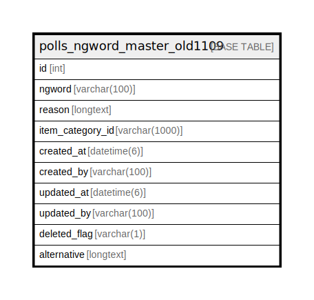

# polls_ngword_master_old1109

## Description

<details>
<summary><strong>Table Definition</strong></summary>

```sql
CREATE TABLE `polls_ngword_master_old1109` (
  `id` int NOT NULL AUTO_INCREMENT,
  `ngword` varchar(100) NOT NULL,
  `reason` longtext NOT NULL,
  `item_category_id` varchar(1000) NOT NULL,
  `created_at` datetime(6) NOT NULL,
  `created_by` varchar(100) NOT NULL,
  `updated_at` datetime(6) NOT NULL,
  `updated_by` varchar(100) NOT NULL,
  `deleted_flag` varchar(1) NOT NULL,
  `alternative` longtext NOT NULL,
  PRIMARY KEY (`id`)
) ENGINE=InnoDB AUTO_INCREMENT=[Redacted by tbls] DEFAULT CHARSET=utf8mb4 COLLATE=utf8mb4_0900_ai_ci
```

</details>

## Columns

| Name | Type | Default | Nullable | Extra Definition | Children | Parents | Comment |
| ---- | ---- | ------- | -------- | ---------------- | -------- | ------- | ------- |
| id | int |  | false | auto_increment |  |  |  |
| ngword | varchar(100) |  | false |  |  |  |  |
| reason | longtext |  | false |  |  |  |  |
| item_category_id | varchar(1000) |  | false |  |  |  |  |
| created_at | datetime(6) |  | false |  |  |  |  |
| created_by | varchar(100) |  | false |  |  |  |  |
| updated_at | datetime(6) |  | false |  |  |  |  |
| updated_by | varchar(100) |  | false |  |  |  |  |
| deleted_flag | varchar(1) |  | false |  |  |  |  |
| alternative | longtext |  | false |  |  |  |  |

## Constraints

| Name | Type | Definition |
| ---- | ---- | ---------- |
| PRIMARY | PRIMARY KEY | PRIMARY KEY (id) |

## Indexes

| Name | Definition |
| ---- | ---------- |
| PRIMARY | PRIMARY KEY (id) USING BTREE |

## Relations



---

> Generated by [tbls](https://github.com/k1LoW/tbls)
