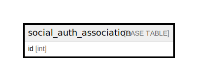

# social_auth_association

## Description

<details>
<summary><strong>Table Definition</strong></summary>

```sql
CREATE TABLE `social_auth_association` (
  `id` int NOT NULL AUTO_INCREMENT,
  `server_url` varchar(255) NOT NULL,
  `handle` varchar(255) NOT NULL,
  `secret` varchar(255) NOT NULL,
  `issued` int NOT NULL,
  `lifetime` int NOT NULL,
  `assoc_type` varchar(64) NOT NULL,
  PRIMARY KEY (`id`),
  UNIQUE KEY `social_auth_association_server_url_handle_078befa2_uniq` (`server_url`,`handle`)
) ENGINE=InnoDB DEFAULT CHARSET=utf8mb4 COLLATE=utf8mb4_0900_ai_ci
```

</details>

## Columns

| Name | Type | Default | Nullable | Extra Definition | Children | Parents | Comment |
| ---- | ---- | ------- | -------- | ---------------- | -------- | ------- | ------- |
| id | int |  | false | auto_increment |  |  |  |
| server_url | varchar(255) |  | false |  |  |  |  |
| handle | varchar(255) |  | false |  |  |  |  |
| secret | varchar(255) |  | false |  |  |  |  |
| issued | int |  | false |  |  |  |  |
| lifetime | int |  | false |  |  |  |  |
| assoc_type | varchar(64) |  | false |  |  |  |  |

## Constraints

| Name | Type | Definition |
| ---- | ---- | ---------- |
| PRIMARY | PRIMARY KEY | PRIMARY KEY (id) |
| social_auth_association_server_url_handle_078befa2_uniq | UNIQUE | UNIQUE KEY social_auth_association_server_url_handle_078befa2_uniq (server_url, handle) |

## Indexes

| Name | Definition |
| ---- | ---------- |
| PRIMARY | PRIMARY KEY (id) USING BTREE |
| social_auth_association_server_url_handle_078befa2_uniq | UNIQUE KEY social_auth_association_server_url_handle_078befa2_uniq (server_url, handle) USING BTREE |

## Relations



---

> Generated by [tbls](https://github.com/k1LoW/tbls)
