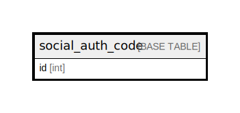

# social_auth_code

## Description

<details>
<summary><strong>Table Definition</strong></summary>

```sql
CREATE TABLE `social_auth_code` (
  `id` int NOT NULL AUTO_INCREMENT,
  `email` varchar(254) NOT NULL,
  `code` varchar(32) NOT NULL,
  `verified` tinyint(1) NOT NULL,
  `timestamp` datetime(6) NOT NULL,
  PRIMARY KEY (`id`),
  UNIQUE KEY `social_auth_code_email_code_801b2d02_uniq` (`email`,`code`),
  KEY `social_auth_code_code_a2393167` (`code`),
  KEY `social_auth_code_timestamp_176b341f` (`timestamp`)
) ENGINE=InnoDB DEFAULT CHARSET=utf8mb4 COLLATE=utf8mb4_0900_ai_ci
```

</details>

## Columns

| Name | Type | Default | Nullable | Extra Definition | Children | Parents | Comment |
| ---- | ---- | ------- | -------- | ---------------- | -------- | ------- | ------- |
| id | int |  | false | auto_increment |  |  |  |
| email | varchar(254) |  | false |  |  |  |  |
| code | varchar(32) |  | false |  |  |  |  |
| verified | tinyint(1) |  | false |  |  |  |  |
| timestamp | datetime(6) |  | false |  |  |  |  |

## Constraints

| Name | Type | Definition |
| ---- | ---- | ---------- |
| PRIMARY | PRIMARY KEY | PRIMARY KEY (id) |
| social_auth_code_email_code_801b2d02_uniq | UNIQUE | UNIQUE KEY social_auth_code_email_code_801b2d02_uniq (email, code) |

## Indexes

| Name | Definition |
| ---- | ---------- |
| social_auth_code_code_a2393167 | KEY social_auth_code_code_a2393167 (code) USING BTREE |
| social_auth_code_timestamp_176b341f | KEY social_auth_code_timestamp_176b341f (timestamp) USING BTREE |
| PRIMARY | PRIMARY KEY (id) USING BTREE |
| social_auth_code_email_code_801b2d02_uniq | UNIQUE KEY social_auth_code_email_code_801b2d02_uniq (email, code) USING BTREE |

## Relations



---

> Generated by [tbls](https://github.com/k1LoW/tbls)
