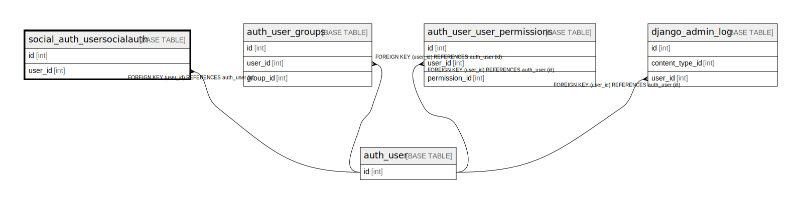

# social_auth_usersocialauth

## Description

<details>
<summary><strong>Table Definition</strong></summary>

```sql
CREATE TABLE `social_auth_usersocialauth` (
  `id` int NOT NULL AUTO_INCREMENT,
  `provider` varchar(32) NOT NULL,
  `uid` varchar(255) NOT NULL,
  `extra_data` longtext NOT NULL,
  `user_id` int NOT NULL,
  PRIMARY KEY (`id`),
  UNIQUE KEY `social_auth_usersocialauth_provider_uid_e6b5e668_uniq` (`provider`,`uid`),
  KEY `social_auth_usersocialauth_user_id_17d28448_fk_auth_user_id` (`user_id`),
  CONSTRAINT `social_auth_usersocialauth_user_id_17d28448_fk_auth_user_id` FOREIGN KEY (`user_id`) REFERENCES `auth_user` (`id`)
) ENGINE=InnoDB AUTO_INCREMENT=[Redacted by tbls] DEFAULT CHARSET=utf8mb4 COLLATE=utf8mb4_0900_ai_ci
```

</details>

## Columns

| Name | Type | Default | Nullable | Extra Definition | Children | Parents | Comment |
| ---- | ---- | ------- | -------- | ---------------- | -------- | ------- | ------- |
| id | int |  | false | auto_increment |  |  |  |
| provider | varchar(32) |  | false |  |  |  |  |
| uid | varchar(255) |  | false |  |  |  |  |
| extra_data | longtext |  | false |  |  |  |  |
| user_id | int |  | false |  |  | [auth_user](auth_user.md) |  |

## Constraints

| Name | Type | Definition |
| ---- | ---- | ---------- |
| PRIMARY | PRIMARY KEY | PRIMARY KEY (id) |
| social_auth_usersocialauth_provider_uid_e6b5e668_uniq | UNIQUE | UNIQUE KEY social_auth_usersocialauth_provider_uid_e6b5e668_uniq (provider, uid) |
| social_auth_usersocialauth_user_id_17d28448_fk_auth_user_id | FOREIGN KEY | FOREIGN KEY (user_id) REFERENCES auth_user (id) |

## Indexes

| Name | Definition |
| ---- | ---------- |
| social_auth_usersocialauth_user_id_17d28448_fk_auth_user_id | KEY social_auth_usersocialauth_user_id_17d28448_fk_auth_user_id (user_id) USING BTREE |
| PRIMARY | PRIMARY KEY (id) USING BTREE |
| social_auth_usersocialauth_provider_uid_e6b5e668_uniq | UNIQUE KEY social_auth_usersocialauth_provider_uid_e6b5e668_uniq (provider, uid) USING BTREE |

## Relations



---

> Generated by [tbls](https://github.com/k1LoW/tbls)
