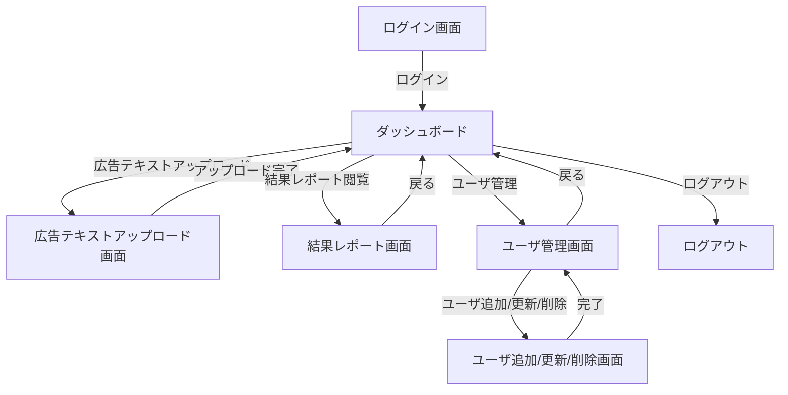

# ■ 画面遷移図
## ■ 利用者
- 広告部門、コンプライアンス監視業務部
- 情報システム部

### ■ 業務フロー遂行における画面遷移図

```mermaid
graph TD
    A[ログイン画面]
    B[ダッシュボード]
    C[広告テキストアップロード画面]
    D[結果レポート画面]
    E[ユーザ管理画面]
    F[ユーザ追加/更新/削除画面]
    G[ログアウト]

    A -- ログイン --> B
    B -- 広告テキストアップロード --> C
    C -- アップロード完了 --> B
    B -- 結果レポート閲覧 --> D
    D -- 戻る --> B
    B -- ユーザ管理 --> E
    E -- ユーザ追加/更新/削除 --> F
    F -- 完了 --> E
    E -- 戻る --> B
    B -- ログアウト --> G
```
