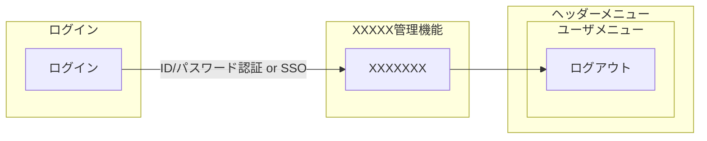
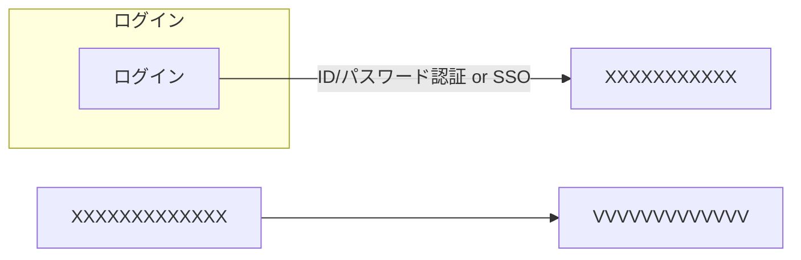

# ■ 画面遷移図
## ■ 要求仕様概要

## ■ 利用者
- 広告部門、コンプライアンス監視業務部
- 情報システム部

## ■ 必須要件
### ■ 業務フロー遂行における画面での必須要件

### ■ システム管理画面必須要件
- XXXXX XXXXXXXXXXXXXXXX
  - XXXXXXXXXXXXXXXXXXXXXXXXXXXXXXX

---
## ■画面遷移図
### ■ 業務フロー遂行における画面での必須要件

### ■ システム管理画面必須要件
