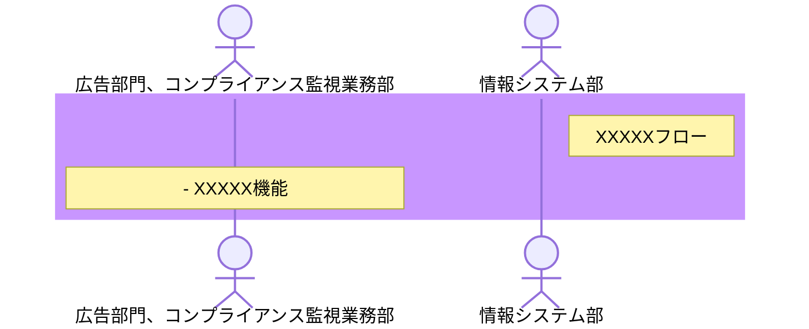
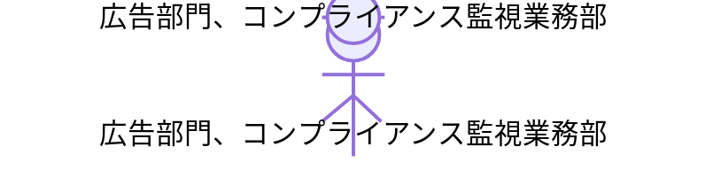

# ■業務フロー図
## ■ 要求仕様概要

## ■登場人物
- 広告部門、コンプライアンス監視業務部
- 情報システム部

## ■LABEL
| 略称 	| 正式名称     	| 意味                                                                 	|
|------	|--------------	|----------------------------------------------------------------------	|
| alt  	| Alternative  	| このブロックで囲まれた処理は特定条件の場合に実行することを示す       	|
| loop 	| Loop         	| このブロックで囲まれた処理は特定条件を満たすまでループすることを示す 	|
| par  	| Parallel     	| このブロックで囲まれた処理は並列で処理することを示す                 	|

## ■ 登場する機能名
- ログイン
- ログアウト
- XXXXXXX

## ■ 業務フロー図
### <広告テキスト自動検知作業フロー>

### <ユーザ追加、更新、削除作業フロー>

