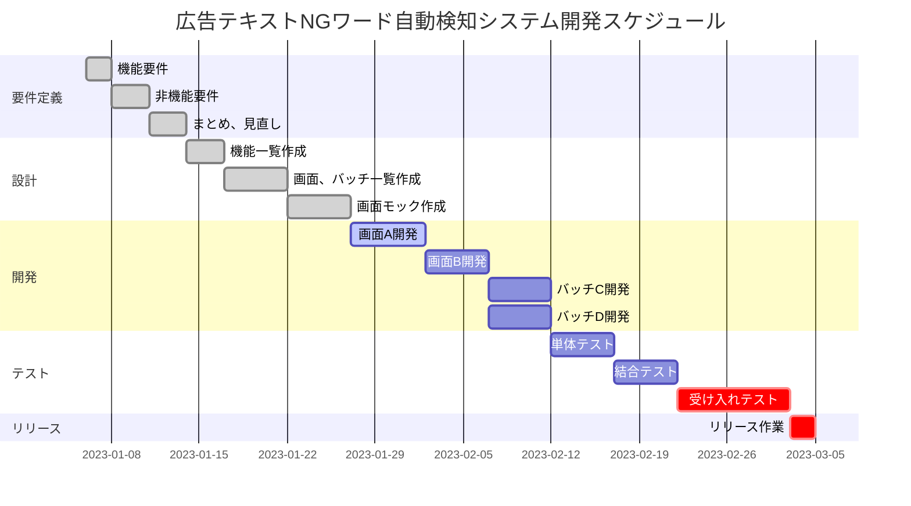

```mermaid
gantt
dateFormat  YYYY-MM-DD
title 広告テキストNGワード自動検知システム開発スケジュール

section 要件定義
機能要件             :done,    des1, 2023-01-06,2023-01-08
非機能要件        　  :done,     des2, 2023-01-08, 3d
まとめ、見直し            :done,      des3, after des2, 3d

section 設計
機能一覧作成           :done,         sek1, 2023-01-14,2023-01-17
画面、バッチ一覧作成    :done,         sek2, after sek1, 5d
画面モック作成         :done,         sek3, after sek2, 5d

section 開発
画面A開発           :active,        dev1, 2023-01-27,2023-02-02
画面B開発           :               dev2, after dev1, 5d
バッチC開発         :              dev3, after dev2, 5d
バッチD開発         :              dev4, after dev2, 5d

section テスト
単体テスト           :         test1, after dev3, 5d
結合テスト           :         test3, after test1, 5d
受け入れテスト        :crit,     test4, after test3, 9d

section リリース
リリース作業        :crit,     rele1, after test4, 2d
```
